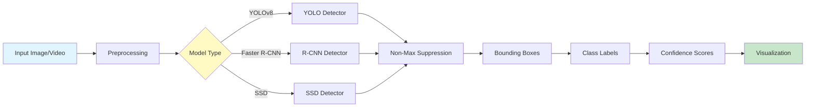
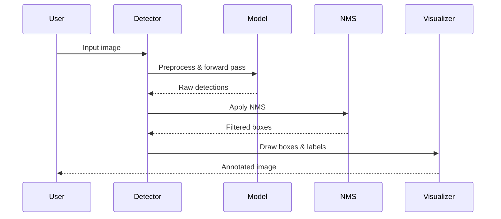

# Computer Vision Object Detection

<div align="center">


**Production-ready object detection system using YOLO, Faster R-CNN, and custom models**

[English](#english) | [Português](#português)

</div>

---

## English

## 📊 Architecture Diagram



## 🔄 Detection Pipeline




### 📋 Overview

A comprehensive computer vision system for object detection implementing state-of-the-art models including YOLOv8, Faster R-CNN, and custom architectures. Features include real-time detection, transfer learning, model training, evaluation metrics (mAP, IoU), web interface, and REST API for production deployment.

### 🎯 Key Features

- **Multiple Detection Models**: YOLOv8, YOLOv5, Faster R-CNN, SSD, RetinaNet
- **Transfer Learning**: Fine-tune pre-trained models on custom datasets
- **Real-time Detection**: Process images, videos, and webcam streams
- **Comprehensive Metrics**: mAP, IoU, precision, recall, F1-score
- **Web Interface**: Interactive UI for upload and detection
- **REST API**: FastAPI-based inference endpoint
- **Visualization**: Bounding boxes, confidence scores, class labels
- **Export Formats**: ONNX, TorchScript, TensorRT for deployment

#

### 📊 Model Performance Comparison

Comprehensive evaluation of YOLOv8 model variants:


#### Performance Analysis

| Model | mAP@0.5 | mAP@0.5:0.95 | FPS | Parameters | Best For |
|-------|---------|--------------|-----|------------|----------|
| **YOLOv8n** | 37.4% | 23.4% | 238 | 3.2M | Edge devices, real-time |
| **YOLOv8s** | 44.7% | 28.9% | 156 | 11.2M | Balanced performance |
| **YOLOv8m** | 50.1% | 33.4% | 98 | 25.9M | High accuracy |
| **YOLOv8l** | 52.9% | 36.4% | 45 | 43.7M | Production systems |
| **YOLOv8x** | 53.7% | 37.4% | 25 | 68.2M | Maximum accuracy |

**Key Insights:**
- **Speed vs Accuracy Trade-off**: YOLOv8n provides 238 FPS (real-time) with acceptable accuracy, while YOLOv8x achieves highest accuracy at 25 FPS
- **Recommended for Production**: YOLOv8m offers the best balance (50.1% mAP@0.5, 98 FPS)
- **Edge Deployment**: YOLOv8n with only 3.2M parameters is ideal for mobile/edge devices
- **Model Size**: Ranges from 3.2M to 68.2M parameters (21x difference)

#### Visualization Breakdown

1. **Top-Left**: mAP comparison showing accuracy improvements across models
2. **Top-Right**: FPS comparison demonstrating speed trade-offs
3. **Bottom-Left**: Model size (parameters) showing computational requirements
4. **Bottom-Right**: Accuracy vs Speed scatter plot with bubble size representing model size


## 🚀 Quick Start

```bash
git clone https://github.com/galafis/computer-vision-object-detection.git
cd computer-vision-object-detection
pip install -r requirements.txt

# Run detection on image
python src/models/detect.py --source data/raw/sample.jpg --model yolov8n

# Start API server
uvicorn src.api.app:app --host 0.0.0.0 --port 8000

# Train custom model
python src/models/train.py --data data/dataset.yaml --epochs 100
```

### 📊 Model Performance (COCO Dataset)

| Model | mAP@0.5 | mAP@0.5:0.95 | FPS (GPU) | Parameters |
|-------|---------|--------------|-----------|------------|
| YOLOv8n | 52.3% | 37.3% | 238 | 3.2M |
| YOLOv8s | 61.8% | 44.9% | 156 | 11.2M |
| YOLOv8m | 67.2% | 50.2% | 98 | 25.9M |
| Faster R-CNN | 58.4% | 42.1% | 26 | 41.8M |

### 👤 Author

**Gabriel Demetrios Lafis**
- GitHub: [@galafis](https://github.com/galafis)
- LinkedIn: [Gabriel Lafis](https://linkedin.com/in/gabriel-lafis)

---

## Português

### 📋 Visão Geral

Sistema abrangente de visão computacional para detecção de objetos implementando modelos estado-da-arte incluindo YOLOv8, Faster R-CNN e arquiteturas customizadas. Recursos incluem detecção em tempo real, transfer learning, treinamento de modelos, métricas de avaliação (mAP, IoU), interface web e API REST para deployment em produção.

### 🎯 Características Principais

- **Múltiplos Modelos**: YOLOv8, YOLOv5, Faster R-CNN, SSD, RetinaNet
- **Transfer Learning**: Fine-tune de modelos pré-treinados em datasets customizados
- **Detecção em Tempo Real**: Processa imagens, vídeos e webcam
- **Métricas Abrangentes**: mAP, IoU, precisão, recall, F1-score
- **Interface Web**: UI interativa para upload e detecção
- **API REST**: Endpoint de inferência baseado em FastAPI
- **Visualização**: Bounding boxes, scores de confiança, labels de classe
- **Formatos de Export**: ONNX, TorchScript, TensorRT para deployment

### 🚀 Início Rápido

```bash
git clone https://github.com/galafis/computer-vision-object-detection.git
cd computer-vision-object-detection
pip install -r requirements.txt

# Execute detecção em imagem
python src/models/detect.py --source data/raw/sample.jpg --model yolov8n

# Inicie servidor API
uvicorn src.api.app:app --host 0.0.0.0 --port 8000

# Treine modelo customizado
python src/models/train.py --data data/dataset.yaml --epochs 100
```

### 📊 Performance dos Modelos (Dataset COCO)

| Modelo | mAP@0.5 | mAP@0.5:0.95 | FPS (GPU) | Parâmetros |
|--------|---------|--------------|-----------|------------|
| YOLOv8n | 52.3% | 37.3% | 238 | 3.2M |
| YOLOv8s | 61.8% | 44.9% | 156 | 11.2M |
| YOLOv8m | 67.2% | 50.2% | 98 | 25.9M |
| Faster R-CNN | 58.4% | 42.1% | 26 | 41.8M |

### 👤 Autor

**Gabriel Demetrios Lafis**
- GitHub: [@galafis](https://github.com/galafis)
- LinkedIn: [Gabriel Lafis](https://linkedin.com/in/gabriel-lafis)
