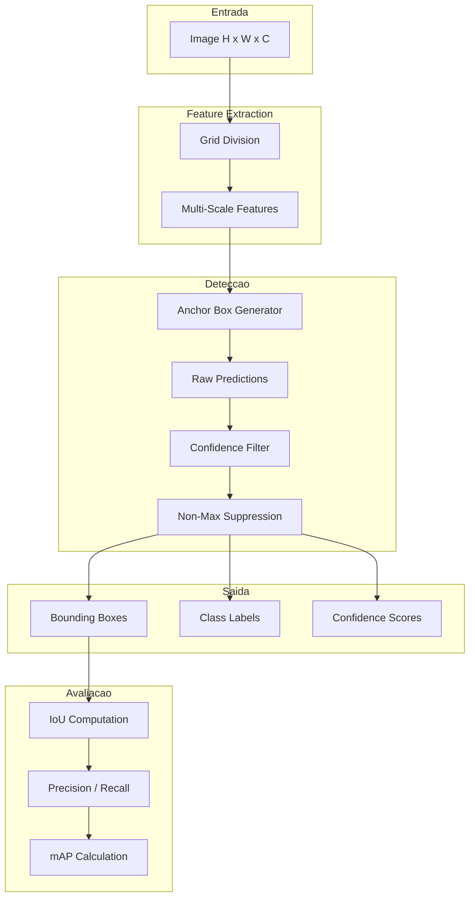
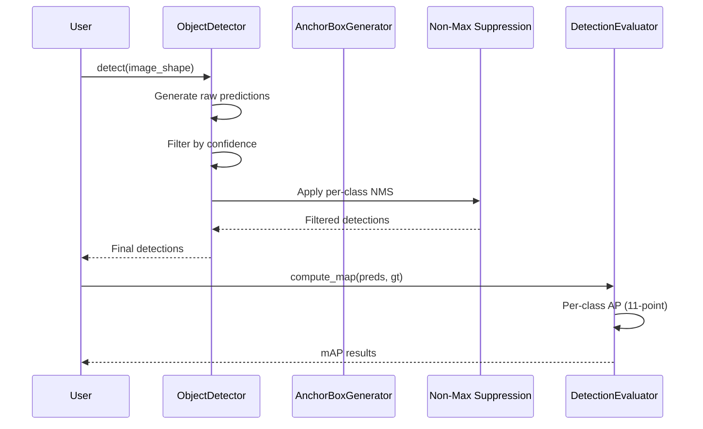

# CV Object Detection YOLO

[](https://www.python.org/)
[](LICENSE)
[](Dockerfile)

Framework de deteccao de objetos inspirado na arquitetura YOLO. Implementa geracao de anchor boxes, Non-Max Suppression, calculo de IoU, utilitarios de bounding box, pipeline de deteccao e metricas de avaliacao (mAP).

Object detection framework inspired by the YOLO architecture. Implements anchor box generation, Non-Max Suppression, IoU calculation, bounding box utilities, detection pipeline, and evaluation metrics (mAP).

---

## Arquitetura / Architecture


```mermaid
graph TB
    subgraph Input["Entrada"]
        IMG[Image H x W x C]
    end

    subgraph Backbone["Feature Extraction"]
        B1[Grid Division]
        B2[Multi-Scale Features]
    end

    subgraph Detection["Deteccao"]
        A1[Anchor Box Generator]
        D1[Raw Predictions]
        D2[Confidence Filter]
        D3[Non-Max Suppression]
    end

    subgraph Output["Saida"]
        O1[Bounding Boxes]
        O2[Class Labels]
        O3[Confidence Scores]
    end

    subgraph Eval["Avaliacao"]
        E1[IoU Computation]
        E2[Precision / Recall]
        E3[mAP Calculation]
    end

    IMG --> B1 --> B2
    B2 --> A1 --> D1
    D1 --> D2 --> D3
    D3 --> O1
    D3 --> O2
    D3 --> O3
    O1 --> E1 --> E2 --> E3
```

## Pipeline de Deteccao / Detection Pipeline


```mermaid
sequenceDiagram
    participant User
    participant Detector as ObjectDetector
    participant Anchors as AnchorBoxGenerator
    participant NMS as Non-Max Suppression
    participant Eval as DetectionEvaluator

    User->>Detector: detect(image_shape)
    Detector->>Detector: Generate raw predictions
    Detector->>Detector: Filter by confidence
    Detector->>NMS: Apply per-class NMS
    NMS-->>Detector: Filtered detections
    Detector-->>User: Final detections
    User->>Eval: compute_map(preds, gt)
    Eval->>Eval: Per-class AP (11-point)
    Eval-->>User: mAP results
```

## Funcionalidades / Features

| Funcionalidade / Feature | Descricao / Description |
|---|---|
| Bounding Box Utils | Conversao xyxy/xywh, clipping, calculo de area / xyxy/xywh conversion, clipping, area calculation |
| IoU Computation | Intersection over Union entre pares de boxes / IoU between box pairs |
| Anchor Box Generator | Geracao multi-escala de anchor boxes / Multi-scale anchor box generation |
| Non-Max Suppression | Remocao de deteccoes sobrepostas / Overlapping detection removal |
| Object Detector | Pipeline completo de deteccao / Full detection pipeline |
| Detection Evaluator | Precision, Recall, F1, AP, mAP / Precision, Recall, F1, AP, mAP |

## Inicio Rapido / Quick Start

```python
from src.models.detector import ObjectDetector, DetectionEvaluator, compute_iou

# Deteccao
detector = ObjectDetector(confidence=0.5, nms_threshold=0.45)
detections = detector.detect((640, 640, 3))

# Avaliacao
evaluator = DetectionEvaluator(iou_threshold=0.5)
ground_truth = [{"class": "person", "bbox": [100, 100, 200, 300]}]
metrics = evaluator.compute_precision_recall(detections, ground_truth)
map_result = evaluator.compute_map(detections, ground_truth)
```

## Testes / Tests

```bash
pytest tests/ -v
```

## Tecnologias / Technologies

- Python 3.9+
- pytest

## Licenca / License

MIT License - veja [LICENSE](LICENSE) / see [LICENSE](LICENSE).
