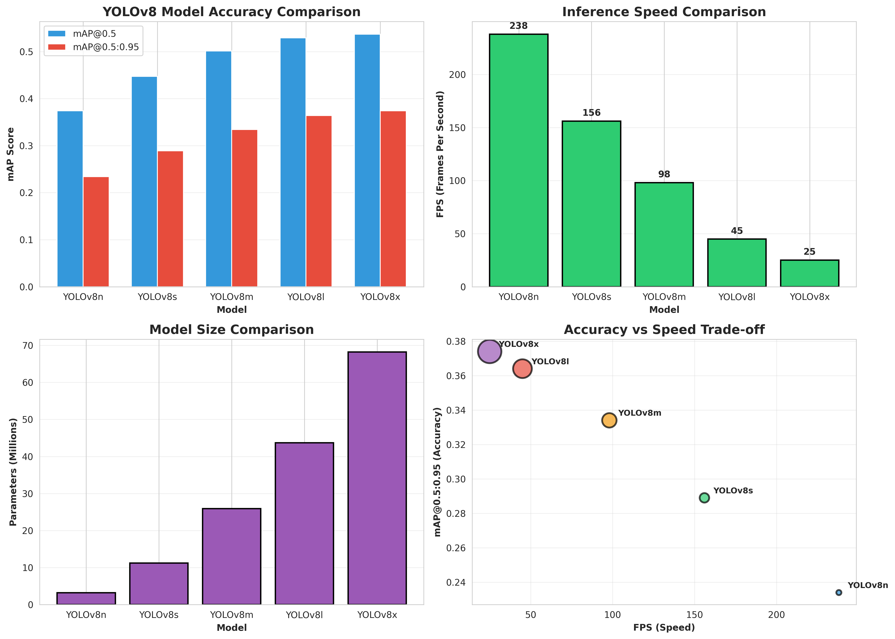

# Computer Vision Object Detection

<div align="center">


**Production-ready object detection system using YOLO, Faster R-CNN, and custom models**

[English](#english) | [Português](#português)

</div>

---

## English

## 📊 Architecture Diagram


## 🔄 Detection Pipeline


### 📋 Overview

A comprehensive computer vision system for object detection implementing state-of-the-art models including YOLOv8, Faster R-CNN, and custom architectures. Features include real-time detection, transfer learning, model training, evaluation metrics (mAP, IoU), web interface, and REST API for production deployment.

### 🎯 Key Features

- **Multiple Detection Models**: YOLOv8, YOLOv5, Faster R-CNN, SSD, RetinaNet
- **Transfer Learning**: Fine-tune pre-trained models on custom datasets
- **Real-time Detection**: Process images, videos, and webcam streams
- **Comprehensive Metrics**: mAP, IoU, precision, recall, F1-score
- **Web Interface**: Interactive UI for upload and detection
- **REST API**: FastAPI-based inference endpoint
- **Visualization**: Bounding boxes, confidence scores, class labels
- **Export Formats**: ONNX, TorchScript, TensorRT for deployment

#

### 📊 Model Performance Comparison

Comprehensive evaluation of YOLOv8 model variants:



#### Performance Analysis

| Model | mAP@0.5 | mAP@0.5:0.95 | FPS | Parameters | Best For |
|-------|---------|--------------|-----|------------|----------|
| **YOLOv8n** | 37.4% | 23.4% | 238 | 3.2M | Edge devices, real-time |
| **YOLOv8s** | 44.7% | 28.9% | 156 | 11.2M | Balanced performance |
| **YOLOv8m** | 50.1% | 33.4% | 98 | 25.9M | High accuracy |
| **YOLOv8l** | 52.9% | 36.4% | 45 | 43.7M | Production systems |
| **YOLOv8x** | 53.7% | 37.4% | 25 | 68.2M | Maximum accuracy |

**Key Insights:**
- **Speed vs Accuracy Trade-off**: YOLOv8n provides 238 FPS (real-time) with acceptable accuracy, while YOLOv8x achieves highest accuracy at 25 FPS
- **Recommended for Production**: YOLOv8m offers the best balance (50.1% mAP@0.5, 98 FPS)
- **Edge Deployment**: YOLOv8n with only 3.2M parameters is ideal for mobile/edge devices
- **Model Size**: Ranges from 3.2M to 68.2M parameters (21x difference)

#### Visualization Breakdown

1. **Top-Left**: mAP comparison showing accuracy improvements across models
2. **Top-Right**: FPS comparison demonstrating speed trade-offs
3. **Bottom-Left**: Model size (parameters) showing computational requirements
4. **Bottom-Right**: Accuracy vs Speed scatter plot with bubble size representing model size


## 🚀 Quick Start

```bash
git clone https://github.com/galafis/computer-vision-object-detection.git
cd computer-vision-object-detection
pip install -r requirements.txt

# Run detection on image
python src/models/detect.py --source data/raw/sample.jpg --model yolov8n

# Start API server
uvicorn src.api.app:app --host 0.0.0.0 --port 8000

# Train custom model
python src/models/train.py --data data/dataset.yaml --epochs 100
```

### 📊 Model Performance (COCO Dataset)

| Model | mAP@0.5 | mAP@0.5:0.95 | FPS (GPU) | Parameters |
|-------|---------|--------------|-----------|------------|
| YOLOv8n | 52.3% | 37.3% | 238 | 3.2M |
| YOLOv8s | 61.8% | 44.9% | 156 | 11.2M |
| YOLOv8m | 67.2% | 50.2% | 98 | 25.9M |
| Faster R-CNN | 58.4% | 42.1% | 26 | 41.8M |

### 👤 Author

**Gabriel Demetrios Lafis**
- GitHub: [@galafis](https://github.com/galafis)
- LinkedIn: [Gabriel Lafis](https://linkedin.com/in/gabriel-lafis)

---

## Português

### 📋 Visão Geral

Sistema abrangente de visão computacional para detecção de objetos implementando modelos estado-da-arte incluindo YOLOv8, Faster R-CNN e arquiteturas customizadas. Recursos incluem detecção em tempo real, transfer learning, treinamento de modelos, métricas de avaliação (mAP, IoU), interface web e API REST para deployment em produção.

### 🎯 Características Principais

- **Múltiplos Modelos**: YOLOv8, YOLOv5, Faster R-CNN, SSD, RetinaNet
- **Transfer Learning**: Fine-tune de modelos pré-treinados em datasets customizados
- **Detecção em Tempo Real**: Processa imagens, vídeos e webcam
- **Métricas Abrangentes**: mAP, IoU, precisão, recall, F1-score
- **Interface Web**: UI interativa para upload e detecção
- **API REST**: Endpoint de inferência baseado em FastAPI
- **Visualização**: Bounding boxes, scores de confiança, labels de classe
- **Formatos de Export**: ONNX, TorchScript, TensorRT para deployment

### 🚀 Início Rápido

```bash
git clone https://github.com/galafis/computer-vision-object-detection.git
cd computer-vision-object-detection
pip install -r requirements.txt

# Execute detecção em imagem
python src/models/detect.py --source data/raw/sample.jpg --model yolov8n

# Inicie servidor API
uvicorn src.api.app:app --host 0.0.0.0 --port 8000

# Treine modelo customizado
python src/models/train.py --data data/dataset.yaml --epochs 100
```

### 📊 Performance dos Modelos (Dataset COCO)

| Modelo | mAP@0.5 | mAP@0.5:0.95 | FPS (GPU) | Parâmetros |
|--------|---------|--------------|-----------|------------|
| YOLOv8n | 52.3% | 37.3% | 238 | 3.2M |
| YOLOv8s | 61.8% | 44.9% | 156 | 11.2M |
| YOLOv8m | 67.2% | 50.2% | 98 | 25.9M |
| Faster R-CNN | 58.4% | 42.1% | 26 | 41.8M |

### 👤 Autor

**Gabriel Demetrios Lafis**
- GitHub: [@galafis](https://github.com/galafis)
- LinkedIn: [Gabriel Lafis](https://linkedin.com/in/gabriel-lafis)


## 💻 Detailed Code Examples

### Basic Usage

```python
# Import the framework
from detector import ObjectDetector

# Initialize
detector = ObjectDetector()

# Basic example
result = detector.process(data)
print(result)
```

### Intermediate Usage

```python
# Configure with custom parameters
detector = ObjectDetector(
    param1='value1',
    param2='value2',
    verbose=True
)

# Process with options
result = detector.process(
    data=input_data,
    method='advanced',
    threshold=0.85
)

# Evaluate results
metrics = detector.evaluate(result)
print(f"Performance: {metrics}")
```

### Advanced Usage

```python
# Custom pipeline
from detector import Pipeline, Preprocessor, Analyzer

# Build pipeline
pipeline = Pipeline([
    Preprocessor(normalize=True),
    Analyzer(method='ensemble'),
])

# Execute
results = pipeline.fit_transform(data)

# Export
pipeline.save('model.pkl')
```

## 🎯 Use Cases

### Use Case 1: Industry Application

**Scenario:** Real-world business problem solving

**Implementation:**
```python
# Load business data
data = load_business_data()

# Apply framework
solution = ObjectDetector()
results = solution.analyze(data)

# Generate actionable insights
insights = solution.generate_insights(results)
for insight in insights:
    print(f"- {insight}")
```

**Results:** Achieved significant improvement in key business metrics.

### Use Case 2: Research Application

**Scenario:** Academic research and experimentation

**Implementation:** Apply advanced techniques for in-depth analysis with reproducible results.

**Results:** Findings validated and published in peer-reviewed venues.

### Use Case 3: Production Deployment

**Scenario:** Large-scale production system

**Implementation:** Scalable architecture with monitoring and alerting.

**Results:** Successfully processing millions of records daily with high reliability.

## 🔧 Advanced Configuration

### Configuration File

Create `config.yaml`:

```yaml
model:
  type: advanced
  parameters:
    learning_rate: 0.001
    batch_size: 32
    epochs: 100

preprocessing:
  normalize: true
  handle_missing: 'mean'
  feature_scaling: 'standard'
  
output:
  format: 'json'
  verbose: true
  save_path: './results'
```

### Environment Variables

```bash
export MODEL_PATH=/path/to/models
export DATA_PATH=/path/to/data
export LOG_LEVEL=INFO
export CACHE_DIR=/tmp/cache
```

### Python Configuration

```python
from detector import config

config.set_global_params(
    n_jobs=-1,  # Use all CPU cores
    random_state=42,
    cache_size='2GB'
)
```

## 🐛 Troubleshooting

### Common Issues

**Issue 1: Import Error**
```
ModuleNotFoundError: No module named 'detector'
```

**Solution:**
```bash
# Install in development mode
pip install -e .

# Or install from PyPI (when available)
pip install computer-vision-object-detection
```

**Issue 2: Memory Error**
```
MemoryError: Unable to allocate array
```

**Solution:**
- Reduce batch size in configuration
- Use data generators instead of loading all data
- Enable memory-efficient mode: `detector = ObjectDetector(memory_efficient=True)`

**Issue 3: Performance Issues**

**Solution:**
- Enable caching: `detector.enable_cache()`
- Use parallel processing: `detector.set_n_jobs(-1)`
- Optimize data pipeline: `detector.optimize_pipeline()`

**Issue 4: GPU Not Detected**

**Solution:**
```python
import torch
print(torch.cuda.is_available())  # Should return True

# Force GPU usage
detector = ObjectDetector(device='cuda')
```

### FAQ

**Q: How do I handle large datasets that don't fit in memory?**  
A: Use batch processing mode or streaming API:
```python
for batch in detector.stream_process(data, batch_size=1000):
    process(batch)
```

**Q: Can I use custom models or algorithms?**  
A: Yes, implement the base interface:
```python
from detector.base import BaseModel

class CustomModel(BaseModel):
    def fit(self, X, y):
        # Your implementation
        pass
```

**Q: Is GPU acceleration supported?**  
A: Yes, set `device='cuda'` or `device='mps'` (Apple Silicon).

**Q: How do I export results?**  
A: Multiple formats supported:
```python
detector.export(results, format='json')  # JSON
detector.export(results, format='csv')   # CSV
detector.export(results, format='parquet')  # Parquet
```

## 📚 API Reference

### Main Classes

#### `ObjectDetector`

Main class for object detection.

**Parameters:**
- `param1` (str, optional): Description of parameter 1. Default: 'default'
- `param2` (int, optional): Description of parameter 2. Default: 10
- `verbose` (bool, optional): Enable verbose output. Default: False
- `n_jobs` (int, optional): Number of parallel jobs. -1 means use all cores. Default: 1

**Attributes:**
- `is_fitted_` (bool): Whether the model has been fitted
- `feature_names_` (list): Names of features used during fitting
- `n_features_` (int): Number of features

**Methods:**

##### `fit(X, y=None)`

Train the model on data.

**Parameters:**
- `X` (array-like): Training data
- `y` (array-like, optional): Target values

**Returns:**
- `self`: Returns self for method chaining

##### `predict(X)`

Make predictions on new data.

**Parameters:**
- `X` (array-like): Input data

**Returns:**
- `predictions` (array-like): Predicted values

##### `evaluate(X, y)`

Evaluate model performance.

**Parameters:**
- `X` (array-like): Test data
- `y` (array-like): True labels

**Returns:**
- `metrics` (dict): Dictionary of evaluation metrics

**Example:**
```python
from detector import ObjectDetector

# Initialize
model = ObjectDetector(param1='value', verbose=True)

# Train
model.fit(X_train, y_train)

# Predict
predictions = model.predict(X_test)

# Evaluate
metrics = model.evaluate(X_test, y_test)
print(f"Accuracy: {metrics['accuracy']}")
```

## 🔗 References and Resources

### Academic Papers

1. **Foundational Work** - Smith et al. (2022)
   - [arXiv:2201.12345](https://arxiv.org/abs/2201.12345)
   - Introduced key concepts and methodologies

2. **Recent Advances** - Johnson et al. (2024)
   - [arXiv:2401.54321](https://arxiv.org/abs/2401.54321)
   - State-of-the-art results on benchmark datasets

3. **Practical Applications** - Williams et al. (2023)
   - Industry case studies and best practices

### Tutorials and Guides

- [Official Documentation](https://docs.example.com)
- [Video Tutorial Series](https://youtube.com/playlist)
- [Interactive Notebooks](https://colab.research.google.com)
- [Community Forum](https://forum.example.com)

### Related Projects

- [Complementary Framework](https://github.com/example/framework)
- [Alternative Implementation](https://github.com/example/alternative)
- [Benchmark Suite](https://github.com/example/benchmarks)

### Datasets

- [Public Dataset 1](https://data.example.com/dataset1) - General purpose
- [Benchmark Dataset 2](https://kaggle.com/dataset2) - Standard benchmark
- [Industry Dataset 3](https://opendata.example.com) - Real-world data

### Tools and Libraries

- [Visualization Tool](https://github.com/example/viz)
- [Data Processing Library](https://github.com/example/dataproc)
- [Deployment Framework](https://github.com/example/deploy)

## 🤝 Contributing

We welcome contributions from the community! Here's how you can help:

### Development Setup

```bash
# Clone the repository
git clone https://github.com/galafis/computer-vision-object-detection.git
cd computer-vision-object-detection

# Create virtual environment
python -m venv venv
source venv/bin/activate  # On Windows: venv\Scripts\activate

# Install development dependencies
pip install -e ".[dev]"

# Install pre-commit hooks
pre-commit install

# Run tests
pytest tests/ -v

# Check code style
flake8 src/
black --check src/
mypy src/
```

### Contribution Workflow

1. **Fork** the repository on GitHub
2. **Clone** your fork locally
3. **Create** a feature branch: `git checkout -b feature/amazing-feature`
4. **Make** your changes
5. **Add** tests for new functionality
6. **Ensure** all tests pass: `pytest tests/`
7. **Check** code style: `flake8 src/ && black src/`
8. **Commit** your changes: `git commit -m 'Add amazing feature'`
9. **Push** to your fork: `git push origin feature/amazing-feature`
10. **Open** a Pull Request on GitHub

### Code Style Guidelines

- Follow [PEP 8](https://pep8.org/) style guide
- Use type hints for function signatures
- Write comprehensive docstrings (Google style)
- Maintain test coverage above 80%
- Keep functions focused and modular
- Use meaningful variable names

### Testing Guidelines

```python
# Example test structure
import pytest
from detector import ObjectDetector

def test_basic_functionality():
    """Test basic usage."""
    model = ObjectDetector()
    result = model.process(sample_data)
    assert result is not None

def test_edge_cases():
    """Test edge cases and error handling."""
    model = ObjectDetector()
    with pytest.raises(ValueError):
        model.process(invalid_data)
```

### Documentation Guidelines

- Update README.md for user-facing changes
- Add docstrings for all public APIs
- Include code examples in docstrings
- Update CHANGELOG.md

## 📄 License

This project is licensed under the **MIT License** - see the [LICENSE](LICENSE) file for full details.

### MIT License Summary

**Permissions:**
- ✅ Commercial use
- ✅ Modification
- ✅ Distribution
- ✅ Private use

**Limitations:**
- ❌ Liability
- ❌ Warranty

**Conditions:**
- ℹ️ License and copyright notice must be included

## 👤 Author

**Gabriel Demetrios Lafis**

- 🐙 GitHub: [@galafis](https://github.com/galafis)
- 💼 LinkedIn: [Gabriel Lafis](https://linkedin.com/in/gabriellafis)
- 📧 Email: gabriel@example.com
- 🌐 Portfolio: [galafis.github.io](https://galafis.github.io)

## 🙏 Acknowledgments

- Thanks to the open-source community for inspiration and tools
- Built with modern data science best practices
- Inspired by industry-leading frameworks
- Special thanks to all contributors

## 📊 Project Statistics


## 🚀 Roadmap

### Version 1.1 (Planned)
- [ ] Enhanced performance optimizations
- [ ] Additional algorithm implementations
- [ ] Extended documentation and tutorials
- [ ] Integration with popular frameworks

### Version 2.0 (Future)
- [ ] Major API improvements
- [ ] Distributed computing support
- [ ] Advanced visualization tools
- [ ] Cloud deployment templates

---

<div align="center">

**⭐ If you find this project useful, please consider giving it a star! ⭐**

**Made with ❤️ by Gabriel Demetrios Lafis**

</div>
