# 🚀 Cv Object Detection Yolo

> Professional Python project implementing Cv Object Detection Yolo

[](https://img.shields.io/badge/)
[](https://img.shields.io/badge/)
[](https://img.shields.io/badge/)
[](LICENSE)

[English](#english) | [Português](#português)

---

## English

### 🎯 Overview

**Cv Object Detection Yolo** is a production-grade Python application that showcases modern software engineering practices including clean architecture, comprehensive testing, containerized deployment, and CI/CD readiness.

The codebase comprises **219 lines** of source code organized across **10 modules**, following industry best practices for maintainability, scalability, and code quality.

### ✨ Key Features

- **⚡ Async API**: High-performance async REST API with FastAPI
- **📖 Auto-Documentation**: Interactive Swagger UI and ReDoc
- **✅ Validation**: Pydantic-powered request/response validation
- **🏗️ Object-Oriented**: 5 core classes with clean architecture

### 🏗️ Architecture

```mermaid
graph TB
    subgraph Client["🖥️ Client Layer"]
        A[Web Client]
        B[API Documentation]
    end
    
    subgraph API["⚡ API Layer"]
        C[Middleware Pipeline]
        D[Route Handlers]
        E[Business Logic]
    end
    
    subgraph Data["💾 Data Layer"]
        F[(Primary Database)]
        G[Cache]
    end
    
    A --> C
    B --> C
    C --> D --> E
    E --> F
    E --> G
    
    style Client fill:#e1f5fe
    style API fill:#f3e5f5
    style Data fill:#fff3e0
```



### 🚀 Quick Start

#### Prerequisites

- Python 3.12+
- pip (Python package manager)

#### Installation

```bash
# Clone the repository
git clone https://github.com/galafis/cv-object-detection-yolo.git
cd cv-object-detection-yolo

# Create and activate virtual environment
python -m venv venv
source venv/bin/activate  # On Windows: venv\Scripts\activate

# Install dependencies
pip install -r requirements.txt
```

#### Running

```bash
# Run the application
python src/main.py
```

### 🧪 Testing

```bash
# Run all tests
pytest

# Run with coverage report
pytest --cov --cov-report=html

# Run specific test module
pytest tests/test_main.py -v

# Run with detailed output
pytest -v --tb=short
```

### 📁 Project Structure

```
cv-object-detection-yolo/
├── assets/
├── data/
│   ├── annotations/
│   ├── processed/
│   └── raw/
├── models/        # Data models
│   └── weights/
├── notebooks/
├── results/
│   ├── images/
│   └── videos/
├── src/          # Source code
│   ├── api/           # API endpoints
│   │   └── __init__.py
│   ├── data/
│   │   └── __init__.py
│   ├── models/        # Data models
│   │   ├── __init__.py
│   │   └── detector.py
│   ├── utils/         # Utilities
│   │   └── __init__.py
│   ├── visualization/
│   │   └── __init__.py
│   └── __init__.py
├── tests/         # Test suite
│   ├── __init__.py
│   └── test_models.py
├── LICENSE
├── README.md
├── requirements.txt
└── setup.py
```

### 🛠️ Tech Stack

| Technology | Description | Role |
|------------|-------------|------|
| **Python** | Core Language | Primary |
| **FastAPI** | High-performance async web framework | Framework |
| **NumPy** | Numerical computing | Framework |

### 🤝 Contributing

Contributions are welcome! Please feel free to submit a Pull Request. For major changes, please open an issue first to discuss what you would like to change.

1. Fork the project
2. Create your feature branch (`git checkout -b feature/AmazingFeature`)
3. Commit your changes (`git commit -m 'Add some AmazingFeature'`)
4. Push to the branch (`git push origin feature/AmazingFeature`)
5. Open a Pull Request

### 📄 License

This project is licensed under the MIT License - see the [LICENSE](LICENSE) file for details.

### 👤 Author

**Gabriel Demetrios Lafis**
- GitHub: [@galafis](https://github.com/galafis)
- LinkedIn: [Gabriel Demetrios Lafis](https://linkedin.com/in/gabriel-demetrios-lafis)

---

## Português

### 🎯 Visão Geral

**Cv Object Detection Yolo** é uma aplicação Python de nível profissional que demonstra práticas modernas de engenharia de software, incluindo arquitetura limpa, testes abrangentes, implantação containerizada e prontidão para CI/CD.

A base de código compreende **219 linhas** de código-fonte organizadas em **10 módulos**, seguindo as melhores práticas do setor para manutenibilidade, escalabilidade e qualidade de código.

### ✨ Funcionalidades Principais

- **⚡ Async API**: High-performance async REST API with FastAPI
- **📖 Auto-Documentation**: Interactive Swagger UI and ReDoc
- **✅ Validation**: Pydantic-powered request/response validation
- **🏗️ Object-Oriented**: 5 core classes with clean architecture

### 🏗️ Arquitetura


### 🚀 Início Rápido

#### Prerequisites

- Python 3.12+
- pip (Python package manager)

#### Installation

```bash
# Clone the repository
git clone https://github.com/galafis/cv-object-detection-yolo.git
cd cv-object-detection-yolo

# Create and activate virtual environment
python -m venv venv
source venv/bin/activate  # On Windows: venv\Scripts\activate

# Install dependencies
pip install -r requirements.txt
```

#### Running

```bash
# Run the application
python src/main.py
```

### 🧪 Testing

```bash
# Run all tests
pytest

# Run with coverage report
pytest --cov --cov-report=html

# Run specific test module
pytest tests/test_main.py -v

# Run with detailed output
pytest -v --tb=short
```

### 📁 Estrutura do Projeto

```
cv-object-detection-yolo/
├── assets/
├── data/
│   ├── annotations/
│   ├── processed/
│   └── raw/
├── models/        # Data models
│   └── weights/
├── notebooks/
├── results/
│   ├── images/
│   └── videos/
├── src/          # Source code
│   ├── api/           # API endpoints
│   │   └── __init__.py
│   ├── data/
│   │   └── __init__.py
│   ├── models/        # Data models
│   │   ├── __init__.py
│   │   └── detector.py
│   ├── utils/         # Utilities
│   │   └── __init__.py
│   ├── visualization/
│   │   └── __init__.py
│   └── __init__.py
├── tests/         # Test suite
│   ├── __init__.py
│   └── test_models.py
├── LICENSE
├── README.md
├── requirements.txt
└── setup.py
```

### 🛠️ Stack Tecnológica

| Tecnologia | Descrição | Papel |
|------------|-----------|-------|
| **Python** | Core Language | Primary |
| **FastAPI** | High-performance async web framework | Framework |
| **NumPy** | Numerical computing | Framework |

### 🤝 Contribuindo

Contribuições são bem-vindas! Sinta-se à vontade para enviar um Pull Request.

### 📄 Licença

Este projeto está licenciado sob a Licença MIT - veja o arquivo [LICENSE](LICENSE) para detalhes.

### 👤 Autor

**Gabriel Demetrios Lafis**
- GitHub: [@galafis](https://github.com/galafis)
- LinkedIn: [Gabriel Demetrios Lafis](https://linkedin.com/in/gabriel-demetrios-lafis)
